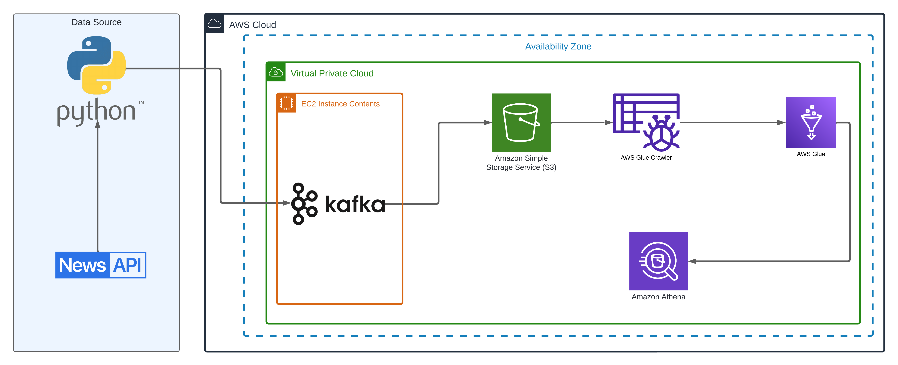

# News Kafka Real Time Data Engineering Project

## Introduction 
This project is an exercise to streamline data from opensource api [News API](https://newsapi.org/) to AWS S3 the query it using AWS athena.

We are going to use different technologies such as Python, Amazon Web Services (AWS), Apache Kafka, Glue, Athena, and SQL.

## Architecture 

## Technology Used
- Programming Language - Python
- Amazon Web Service (AWS)
1. S3 (Simple Storage Service)
2. Athena
3. Glue Crawler
4. Glue Catalog
5. EC2
- Apache Kafka

